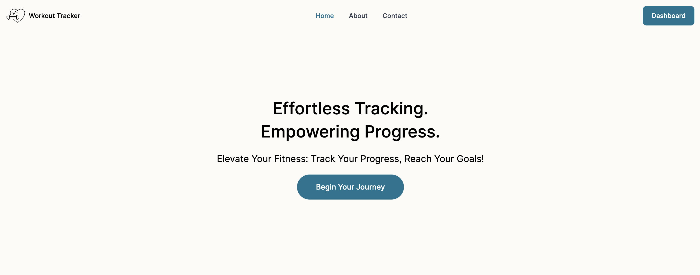

<div>
  
</div>

# Workout Tracker

Workout Tracker is a web application committed to providing a seamless tracking experience
for users who are looking to monitor their workout progress. The
platform eliminates the hassle of manual tracking by offering an
intuitive and user-friendly interface that can be easily
customized to fit individual needs.

## Table of Contents

- [About Wrokout Tracker](#about-workout-tracker)
  - [Tech Stack](#tech-stack)
- [Getting Started](#getting-started)
- [Repo Structure](#repo-structure)

## About Workout Tracker

<div>
  
</div>

### Tech Stack

- **Frontend:**
  - **Language:** TypeScript
  - **Framework:** React, NextJS
  - **Styling:** Tailwind CSS + Sass
  - **Linting:** ESLint, Prettier
- **Backend:**
  - **Language:** Firebase

## Repo Structure

Want to just poke around? Here's a quick overview of the repo structure. Most sub-folders have their own README for more in-depth explanations.

```
├── public/           # Assets
├── src/              # Source folder of the application (containing all main logic)
├── src/firebase      # Firebase configuration and utility functions
├── src/app           # App router that primarily contains all UI logic
```